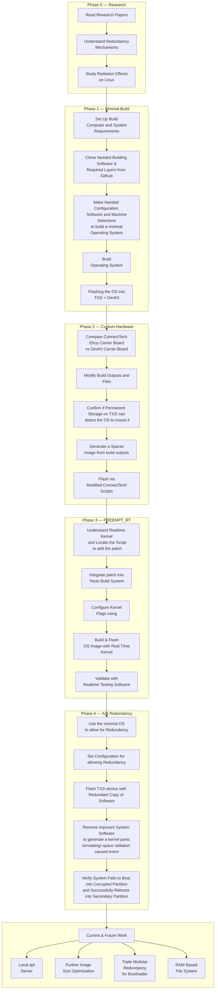

# Project Roadmap

This roadmap guides you through the entire development lifecycle of the Space Operating Linux build for the Jetson TX2i + Elroy Carrier Board. Each phase builds upon the previous, progressing from theoretical foundations to a fully functional, real-time capable system image.

!!! info "How to Use This Roadmap"
    Follow the phases sequentially. Each phase page contains process diagrams, key concepts, and step-by-step outlines. Links to relevant pages, repositories, and tools are provided inline.

---

## Progress Tracker

| Week | Phase | Activity | Status |
|:---:|---|---|:---:|
| 1–2 | Phase 0 | Literature review and redundancy concepts | Complete |
| 2–3 | Phase 1 | Minimal Yocto build for TX2i Device + TX2 DevKit Carrier Board | Complete |
| 3–4 | Phase 2 | Adaptation for TX2i + Elroy carrier board | Complete |
| 4   | Phase 3 | Applying the PREEMPT_RT kernel patch to Phase 2, RT testing | Complete |
| 4-5 | Phase 4 (Current) | A/B partitioning redundancy and bootloader failover config | In Progress |
| 5–6 | Phase 5 | TMR bootloader, RAM filesystem, image minimization | Planned |

---

## High-Level Development Flow

---

## Phase Overview

### Phase 0 — Literature & Redundancy Concepts

Research · Week 1–2

!!! warning "Living Document"
    This is a continuous process and is still not 100% understood. The content is adapted to the best of the author's ability and will be updated as understanding deepens.

A deep dive into the research papers that form the theoretical foundation of this project, and the hardware/software redundancy mechanisms that make Linux viable for Low Earth Orbit (LEO) missions.

**Key Topics:** Radiation effects in space -  single-event upsets (SEU), partition redundancy concepts, boot failure analysis, Triple Modular Redundancy (TMR).

→ [Enter Phase 0](phase0/index.md)

---

### Phase 1 — Minimal Yocto Build

Development · Week 2–3

Build a minimal system image using the Yocto Project for the Jetson TX2i, initially targeting the TX2 Development Kit board. This phase covers the complete build pipeline from host setup to flashing.

**Key Topics:** What is Poky (the reference distribution), the Kirkstone branch, adding layers (meta-tegra, meta-ros), configuring bblayers.conf and local.conf, building with bitbake.

→ [Enter Phase 1](phase1/index.md)

---

### Phase 2 — Custom Hardware Adaptation

Hardware · Week 3–4

Transition the build from the NVIDIA DevKit to the Connect Tech Elroy carrier board. This phase navigates device tree differences, flash script modifications, and a dead-end attempt with the Warrior branch.

**Key Topics:** Carrier boards vs DevKits, Device Tree Blobs (DTB files), configuration files (CFG, extlinux.conf), generating sparse images with mksparse, ConnectTech BSP flashing scripts, lessons from the Warrior vs Kirkstone branch mismatch.

→ [Enter Phase 2](phase2/index.md)

---

### Phase 3 — PREEMPT_RT Kernel Patch

Kernel · Week 4

Apply the PREEMPT_RT real-time patch to the Linux kernel through the Yocto build system, enabling deterministic scheduling required for time-critical space payload operations.

**Key Topics:** What real-time scheduling means, the PREEMPT_RT patch, integrating patches via Yocto kernel recipes, configuring kernel flags, validating with cyclictest, latency profiling and interpreting results.

→ [Enter Phase 3](phase3/index.md)

---

### Phase 4 — A/B Partition Redundancy

Redundancy · Weeks 4-5

Configure A/B hardware and software redundancy on the Jetson TX2i, including bootloader-level failover parameters (`smd_info.cfg`), RootFS slot allocations (`ROOTFS_AB=1`), and serial boot console recovery validation.

**Key Topics:** What A/B partitioning is and why it matters, RootFS partition layout, the Slot Metadata Database (SMD) and how it tracks boot slots, configuring failover via Connect Tech flashing wrappers, simulating failure with kernel panics, verifying automatic fallback to the secondary partition.

→ [Enter Phase 4](phase4/index.md)

---

### Future Work

- Add direct updates via a local package management server, and redundancy for bootloader and root file system (A/B) redundancy. 
- Further add to this by adding:
    - Triple Modular Redundancy at the bootloader level.
    - Furtherminimizing the system image size.
    - Implementing a RAM-based filesystem to protect the EMMC/ Flash storage by minimizing write operations on it.